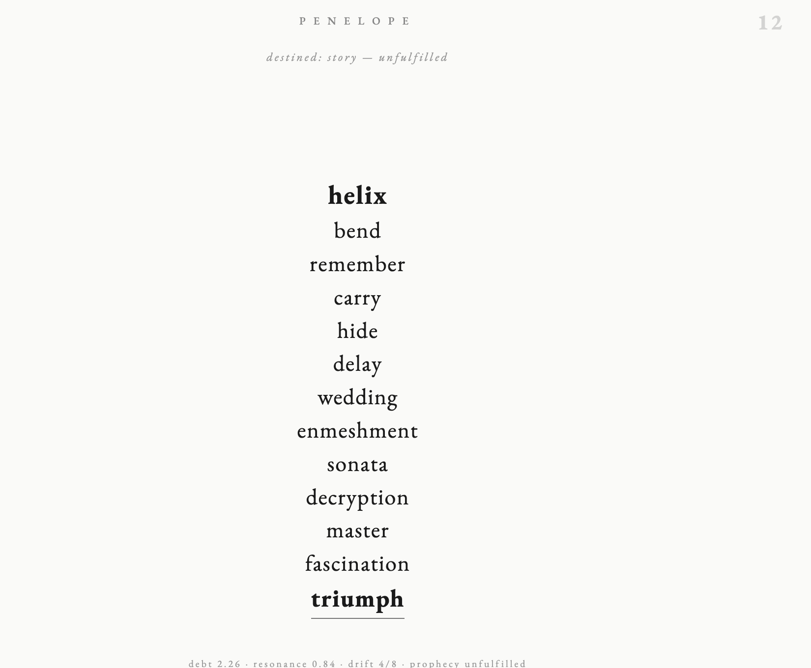
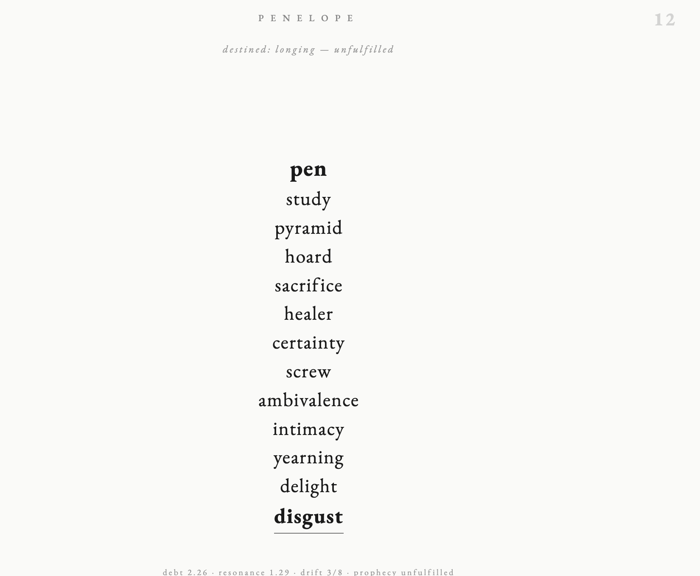
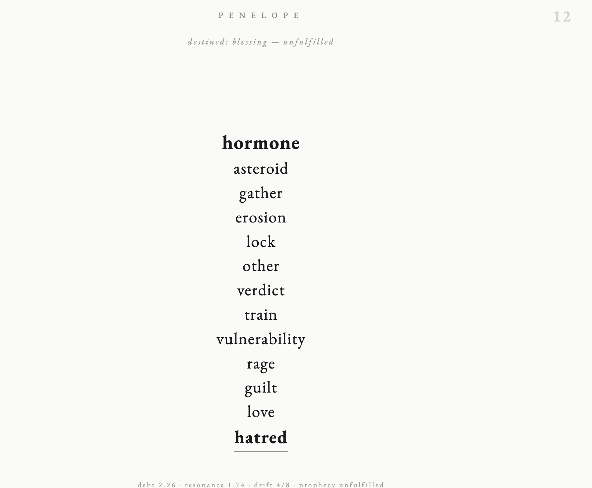
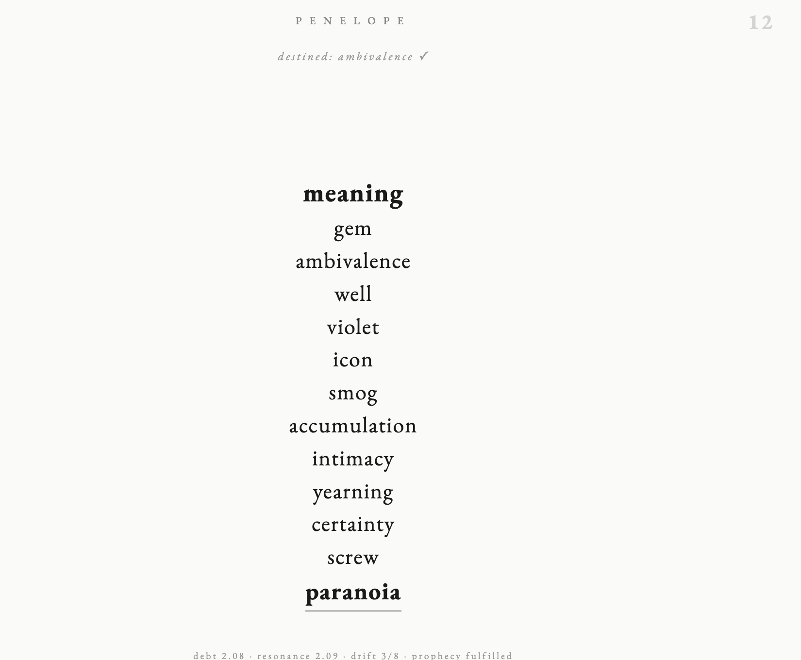

# 1984. Penelope.

---

Janus Architecture.

*by Arianna Method.*

<p align="center">
  
</p>

Not a transformer. Not pretending to be.

Penelope represents a shift toward post-probabilistic, post-symbolic AI. She doesn't predict the next token from a statistical distribution over a corpus. She resonates. A fixed vocabulary of exactly 1984 words — body, nature, emotion, time, society, abstraction, action, ritual, geometry, myth — becomes a closed universe of meaning. Every output is a real word. Gibberish is architecturally impossible.

## Introduction

Say hello to Penelope. Or type something. It doesn't matter — she will detect your most charged word (or just the noisiest one) and walk 12 steps from it. Each step is another generation. Twelve steps, twelve different weight sets, twelve lenses on the same context. Step 1 sees the surface. Step 12 sees the bone.

Penelope works in two modes. In **weightless mode** (no training), she generates coherent associative chains from the Dario Field alone — Hebbian co-occurrence, bigram affinity, prophecy, destiny, and six Kuramoto-coupled emotional chambers. Even without training, the dual tokenizer guarantees meaningful output: BPE on input to read arbitrary text with nuance, word-level on output to ensure every generation is a clean, real word.

After **training**, each of the 12 steps acquires its own ~1.03M parameters (RRPRAM resonance matrix + RMSNorm + SwiGLU). Total ~13M params across 12 steps plus 762K shared embedding. The learned logits combine with the Dario Field overlay at inference time.

The architecture per step:

```
context = pool(embed(words))
query   = RMSNorm(context @ Wr)           RRPRAM resonance
hidden  = SwiGLU(query; gate, up, down)
logits  = (query + hidden) @ E^T           tied output
logits += DarioField(context)              live overlay
word    = sample(softmax(logits))
```

The Dario Equation:

```
p(x|Φ) = softmax((B + α·H + β·F + γ·A + T) / (τ · vibe))
```

Where B is bigram affinity, H is Hebbian co-occurrence, F is prophecy fulfillment, A is destiny attraction, T is trauma gravity — all modulated by 6 Kuramoto oscillators (fear, love, rage, void, flow, complexity). Adam optimizer. Analytical backward through the full graph including SwiGLU and RMSNorm.

### Examples

All examples below are from the JavaScript version running in a browser. Weightless mode — no training. The dual tokenizer at work.

**"hello"** — destined: story — unfulfilled

<p align="center">
  
</p>

> helix → bend → remember → carry → hide → delay → wedding → enmeshment → sonata → decryption → master → fascination → **triumph**

**"Penelope"** — destined: longing — unfulfilled

<p align="center">
  
</p>

> pen → study → pyramid → hoard → sacrifice → healer → certainty → screw → ambivalence → intimacy → yearning → delight → **disgust**

She hears her own name and walks from pen to disgust through sacrifice and yearning.

**"how are you?"** — destined: blessing — unfulfilled

<p align="center">
  
</p>

> hormone → asteroid → gather → erosion → lock → other → verdict → train → vulnerability → rage → guilt → love → **hatred**

Asked how she's doing, she ends on hatred. Through love.

**"what is the meaning of life?"** — destined: ambivalence — **fulfilled**

<p align="center">
  
</p>

> meaning → gem → ambivalence → well → violet → icon → smog → accumulation → intimacy → yearning → certainty → screw → **paranoia**

The only fulfilled prophecy. She was destined for ambivalence — and found it at step 3. Then kept walking anyway, past intimacy and yearning, through certainty, into paranoia.

## Implementations

The multiplicity of language implementations underscores the fundamentality of the architecture. Penelope is not bound to a runtime or a framework. The same resonance engine, the same 1984 words, the same 12 steps — expressed identically across 8 programming languages:

| Language | File | Build |
|----------|------|-------|
| JavaScript | `penelope.html` | Open in browser |
| C | `penelope.c` | `cc penelope.c -O2 -lm -o penelope` |
| TypeScript | `penelope.ts` | `npx tsx penelope.ts` |
| Python | `penelope.py` | `python3 penelope.py` |
| Rust | `penelope.rs` | `rustc -O penelope.rs -o penelope_rs` |
| Zig | `penelope.zig` | `zig build-exe penelope.zig` |
| Julia | `penelope.jl` | `julia penelope.jl` |
| **AML** | `penelope.aml` | `./amlc penelope.aml --run` |

AML — the Arianna Method Language — is the only implementation that is not a single file. It ships with a dedicated mini-compiler (`ariannamethod/ariannamethod.c`) that transpiles `BLOOD COMPILE` blocks to native C. AML provides the ceremony. C provides the math. Together they form the resonance engine.

```
cc ariannamethod/ariannamethod.c -o amlc
./amlc penelope.aml -o penelope_aml
./penelope_aml "darkness eats the city"
```

## Usage

Every implementation supports the same interface:

```bash
./penelope                              # interactive REPL
./penelope "darkness eats the city"     # single chain from text
./penelope --train corpus.txt           # train 5000 steps
./penelope --train corpus.txt --steps N # train N steps
./penelope --load penelope.bin          # load trained weights
./penelope --save penelope.bin          # save weights after training
```

## The 1984 Words

The vocabulary is curated, not scraped. 29 semantic categories:

Body, Nature, Emotion, Time, Society, Abstract, Action, Material, Food, Architecture, Relationship, Philosophy, Music, Weather, Ritual, Labor, Geometry, Animal, Color, Transport, Domestic, Communication, Medical, Cosmic, Bureaucracy, Mythic, Textual, Psychological, Final.

No word is wasted. No word is missing.

---

*By Arianna Method.*
